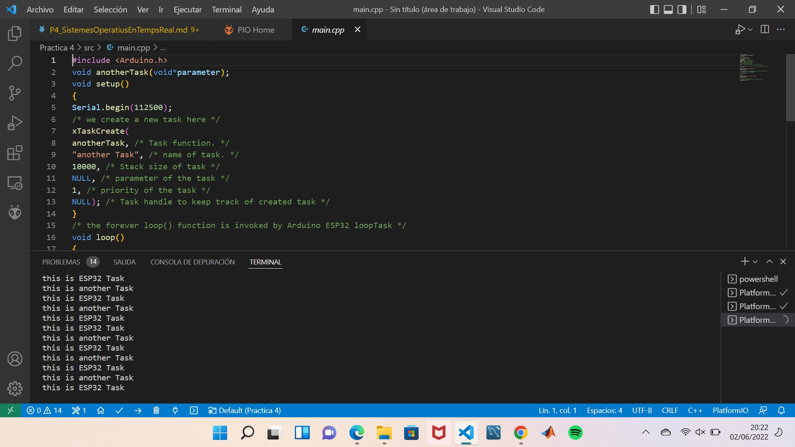

# **PRÀCTICA 4: SISTEMES OPERATIUS EN TEMPS REAL**
## **PART A: Programa Multitasca**
### **4.1 Codi**
````c++
#include <Arduino.h> 

    void anotherTask(void*parameter);  
    void setup() {  
    Serial.begin(112500);  
    /* we create a new task here */
    xTaskCreate(anotherTask, /* Funció tasca. */  
    "another Task", /* nom de la tasca. */  
    10000, /* tamany de la tasca */  
    NULL, /* parametre de la tasca */  
    1, /* Prioritat de la tasca */  
    NULL); /* Task handle to keep track of created task*/  
    }  
    /* the forever loop() function is invoked by Arduino ESP32 loopTask */  

    void loop(){ 
 
    Serial.println("this is ESP32 Task");  
    vTaskDelay(1000);  
    }  
    /* this function will be invoked when additionalTask was created */
    void anotherTask( void * parameter )
    {  
    /* loop forever */  
    for(;;)  
    {  
    Serial.println("this is another Task");  
    vTaskDelay(1340);  
    }  
    /* delete a task when finish,
    this will never happen because this is infinity loop */  
    vTaskDelete( NULL );  
    }  
````

### **4.2 Funcionament**
En el programa es crea una primera tasca mitjançant la funció xTaskcreate amb tota la informació corresponent a la tasca que estem creant (another task). Llavors dins el bucle tenim les impresions que sortiran per pantalla amb el serial print en funcio de les diferents tasques executades. Aquestes impresions tenen diferents delays de manera que els missatges que sortiran per pantalla ho faran a destemps ja que se li dona mes prioritat a una que a l'altre.



## **PART B: Programa multitasca aplicat a uns LED**
### **4.4 Codi**

```c++

#include <Arduino.h>  

    TaskHandle_t Task1;  
    TaskHandle_t Task2;  
    TaskHandle_t Task3;  

    const int led_1 = 32;  
    const int led_2 = 25;  
    const int PTM = 34;  

    void Task1code( void * parameter );  
    void Task2code( void * parameter );  
    void Task3code( void * parameter );  

    void setup() {  
        Serial.begin(115200);   
        pinMode(led_1, OUTPUT);  
        pinMode(led_2, OUTPUT);  
        pinMode(PTM, INPUT);  

        xTaskCreatePinnedToCore(Task1code,"Task1",10000,NULL,1,&Task1,0);                           
        delay(500);   

        xTaskCreatePinnedToCore(Task2code,"Task2",10000,NULL,1,&Task2,1);            
        delay(500);   

        xTaskCreatePinnedToCore(Task3code,"Task3",10000,NULL,1,&Task3,1);            
        delay(500);   
  
    }  

    void Task1code( void * parameter ){  
        Serial.print("Task1 is running on core ");  
        Serial.println(xPortGetCoreID());  

        for(;;){  
            digitalWrite(led_1, HIGH);  
            delay(500);  
            digitalWrite(led_1, LOW);  
            delay(500);  
        }   
    }  

    void Task2code( void * parameter ){  
        Serial.print("Task2 is running on core ");  
        Serial.println(xPortGetCoreID());  

        for(;;){  
            digitalWrite(led_2, HIGH);  
            delay(1000);  
            digitalWrite(led_2, LOW);  
            delay(1000);  
        }  
    }  

    void Task3code( void * parameter ){  
        Serial.print("Task3 is running on core ");  
        Serial.println(xPortGetCoreID());  
        int A;  

        for(;;){  
            A = analogRead(PTM);  
            Serial.println(A);  
            delay(1000);  
        }  
    }  

    void loop() {  

    } 
``` 

### **4.5 Funcionament**
Aquest codi el que fa és aplicar el programa multitasca anterior a un LED. D'aquesta manera el que es fa primer és declarar els LEDS i els seus respectius pins, igual que els voids de les 3 tasques.  
Llavors el que fa és que la tasca 1 encén i apaga el LED cada 500 ms mitjançant delays i els digitalwrite. Que els digitalwrite són els que determinaran si el LED està encès o apagat en funció del voltatge. Per altra banda, la tasca 2 fa exactament el mateix que la tasca 1 però la diferencia està en el fet que aquesta s'encarrega del LED 2 i en comptes de tenir un delay de 500ms el te de 1000ms.   
Finalment, la tasca 3 és la que fa el analogread del que esta passant, imprimint per pantalla 'A' i té un delay de 1000ms.

El video d'exemple del funcionament esta penjat.
https://drive.google.com/file/d/1So3DB_XK4snkRWNBfuYHNxEVx8JJrki2/view?usp=sharing


